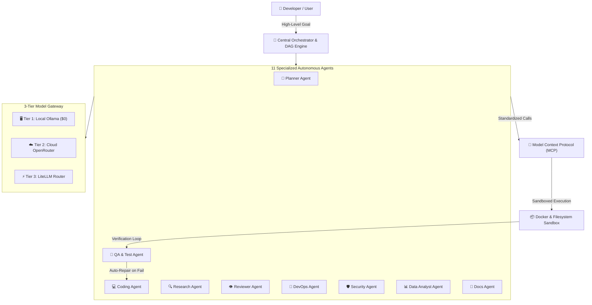

# Kernel Base Documentation — AI-Native Multi-Agent IDE

<div align="center">


### Production Research, System Architecture & Multi-Agent Orchestration Specification

[](https://github.com/Sujoymoulick/kernelbase-docs)
[](https://github.com/Sujoymoulick/kernelbase-docs/releases)
[](LICENSE)
[](https://react.dev)
[](https://www.typescriptlang.org)
[](https://tailwindcss.com)
[](https://vitejs.dev)

[Explore Documentation](#documentation-directory) • [Architecture Overview](#system-architecture) • [Agent System](#11-autonomous-agents) • [Release Roadmap](#versioning--release-milestones) • [Quick Start](#quick-start)

</div>

---

## 🌟 Overview

**Kernel Base** is the architectural specification and systems blueprint for next-generation **AI-Native Multi-Agent Integrated Development Environments (IDEs)**. 

This repository contains the full interactive documentation platform featuring deep-dive architectural specifications, DAG task scheduling algorithms, multi-tier LLM gateway configurations, 11 specialized agent topologies, sandbox security models, and a complete 10-day MVP execution sprint.

> [!IMPORTANT]
> **Release Preview Announcement**: Kernel Base Documentation is currently in **`v0.1.0-preview`**. The initial public open-source release is **releasing shortly on GitHub**.

---

## 🏗️ System Architecture & Highlights



- **Dynamic DAG Task Engine**: Task decomposition with automated dependency resolution, topological sorting, and concurrent sub-task scheduling.
- **11 Autonomous Specialized Agents**: Planner, Orchestrator, Coding, Research, Data Analyst, QA, Reviewer, DevOps, Security, Documentation, and Custom extensible agents.
- **3-Tier Hybrid Model Router**: Intelligent model routing prioritizing local $0 compute (Ollama/Llama 3/DeepSeek) before falling back to cloud providers via OpenRouter and LiteLLM.
- **Model Context Protocol (MCP)**: Native tool protocol support for isolated filesystem manipulation, Git worktrees, terminal execution, and browser automation via Playwright.
- **Autonomous Test & Repair Loop**: Closed-loop testing that diagnoses unit/integration failures and dispatches targeted automatic patches.
- **Signature Left-to-Right Theme Transition**: 60–120 FPS hardware-accelerated horizontal theme wipe across all viewport breakpoints.

---

## 🤖 11 Autonomous Agents

| Agent | Primary Role & Responsibility | Core Tools & Protocol |
| :--- | :--- | :--- |
| **Planner Agent** | Task decomposition, milestone estimation, dependency mapping | Task Graph DAG, Work Breakdown Structure |
| **Orchestrator Agent** | Dynamic agent dispatching, execution lifecycle, event broker | Server-Sent Events (SSE), State Store |
| **Coding Agent** | Synthesizing code, refactoring, context-aware editing | MCP Filesystem, LSP, AST Parser |
| **Research Agent** | Codebase exploration, web search, dependency documentation | DuckDuckGo / Tavily API, Vector Retrieval |
| **QA Agent** | Test suite generation, test execution, coverage auditing | Docker Sandbox, Jest/Pytest Runner |
| **Reviewer Agent** | Code quality checks, style enforcement, pull request reviews | Static Analysis, Linter, Security Rules |
| **DevOps Agent** | CI/CD pipelines, container provisioning, cloud deployment | Docker Compose, GitHub Actions, Cloudflare |
| **Security Agent** | Secret scanning, dependency CVE auditing, permission bounding | Semgrep, OWASP Scanner, MCP Permissions |
| **Data Analyst Agent** | Token consumption telemetry, latency monitoring, cost metrics | Prometheus, ClickHouse / DuckDB |
| **Documentation Agent** | Automatic docstring generation, architecture sync, API specs | Mermaid.js, TypeDoc, Markdown Parser |
| **Custom Agent** | User-defined agents with custom prompts, capabilities, & permissions | Capability Registry, Plugin SDK |

---

## 🗺️ Versioning & Release Milestones

| Version | Status | Milestone Description |
| :--- | :--- | :--- |
| **`v0.1.0-preview`** | 🟢 **Current Preview** | Initial architectural documentation, DAG specifications, and interactive widgets. **Releasing shortly on GitHub**. |
| **`v0.2.0-beta`** | 🟡 Upcoming | Agent core runtime prototype, MCP tool bridge integration, and local CLI runner. |
| **`v0.5.0`** | ⚪ Planned | Cross-platform Desktop IDE preview (Electron/Tauri) with Docker runtime integration. |
| **`v1.0.0`** | ⚪ Planned | Production-grade multi-agent IDE general availability, team collaboration, and cloud sync. |

---

## 📂 Documentation Directory

```
├── 🚀 Get Started             # Introduction, Core Concepts, Desktop App Setup, First Run
├── 🏛️ System Architecture      # Runtime, Orchestrator, Task Graph DAG, Workspace Isolation
├── 🤖 Agent Directory         # 11 In-Depth Agent Specifications & Custom Agent Guides
├── 🔄 Autonomy & Test Loop     # Autonomous Execution, Parallelization, Auto-Repair Engine
├── 🧠 Models & Gateway        # 3-Tier Router, Ollama, OpenRouter, Token & Cost Optimization
├── 🔌 Tools & MCP Protocol     # MCP Servers, Docker Sandbox, Terminal & Browser Automation
├── 💻 Desktop Application     # Desktop Architecture, IPC Bridge, Local Workspace Engine
├── 🆓 Free Tech Stack ($0)    # Zero-Cost Student & Developer Architecture Guide
├── 🔨 Build & Implementation  # Database Schemas, REST/WebSocket API Specifications
├── 📅 10-Day MVP Plan         # Step-by-Step Daily Execution Blueprint from Day 1 to Day 10
├── 🔬 Research & Benchmarks   # Multi-Agent Topologies, Sandbox Security, Cost Studies
├── 📚 Resources & Ecosystem   # LangGraph vs DAGs, OpenHands/Cline Analysis, MCP Manual
├── 🗺️ Roadmap                 # Release Milestones, Cloud Collaboration, Agent Marketplace
└── 📖 API Reference           # REST & WebSocket Endpoints, Event Schemas, Config Reference
```

---

## 🚀 Quick Start

### Prerequisites

- **Node.js**: `v20.0.0` or higher
- **Package Manager**: `npm`, `pnpm`, or `bun`

### Installation & Development

1. **Clone the repository**:
   ```bash
   git clone https://github.com/Sujoymoulick/kernelbase-docs.git
   cd kernelbase-docs
   ```

2. **Install dependencies**:
   ```bash
   npm install
   ```

3. **Start the local development server**:
   ```bash
   npm run dev
   ```
   Open your browser at `http://localhost:3000`.

4. **Build for production**:
   ```bash
   npm run build
   ```

5. **Preview production build**:
   ```bash
   npm run preview
   ```

---

## 🛠️ Tech Stack

- **Framework**: [React 19](https://react.dev) + [TypeScript](https://www.typescriptlang.org)
- **Styling**: [Tailwind CSS v4](https://tailwindcss.com)
- **Build Tool**: [Vite 8](https://vitejs.dev)
- **Diagrams & Visualizations**: [Mermaid.js](https://mermaid.js.org) + Custom Interactive SVG DAG Engines
- **Icons**: [Lucide React](https://lucide.dev)
- **Motion**: GPU-accelerated CSS View Transitions Level 1 + Custom Compositor Hooks

---

## 🤝 Open Source & Contributing

We welcome community contributions, architectural discussions, and feature proposals!

1. Fork the repository
2. Create your feature branch (`git checkout -b feature/amazing-feature`)
3. Commit your changes (`git commit -m 'feat: Add amazing feature'`)
4. Push to the branch (`git push origin feature/amazing-feature`)
5. Open a Pull Request

---

## 📜 License

Distributed under the **Apache License 2.0**. See [`LICENSE`](LICENSE) for more information.

<div align="center">

Made with ❤️ by the **Kernel Base Team** • *AI-Native Multi-Agent IDE Architecture*

</div>
