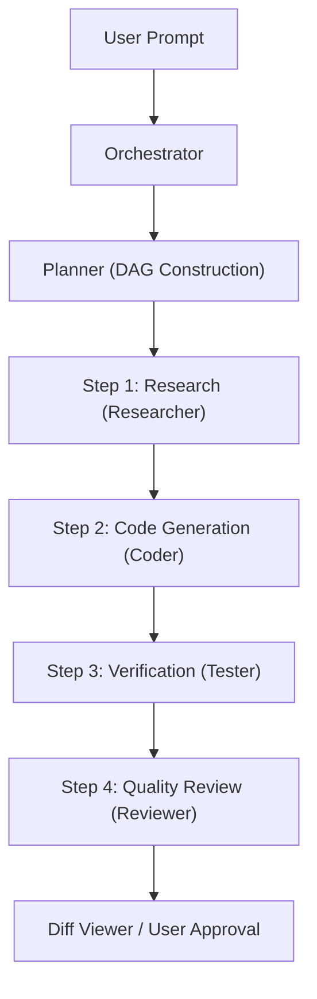

# Kernel Base Multi-Agent Runtime

The Kernel Base multi-agent runtime coordinates autonomous and semi-autonomous AI agents across the software development lifecycle.

## Agent Hierarchy & Roles

1. **Orchestrator Agent**:
   - Master coordinator that assesses user goals, initializes workflows, and delegates sub-tasks to specialized domain agents.
2. **Planner Agent**:
   - Analyzes requirements, checks workspace architecture, and generates directed acyclic graph (DAG) task execution plans with dependencies.
3. **Coder Agent**:
   - Implements features, refactors codebases, generates diffs, and adheres to clean architecture principles.
4. **Tester Agent**:
   - Discovers test runners (`vitest`, `jest`, `cargo test`, `pytest`, `go test`), synthesizes edge-case test suites, and runs regressions.
5. **Reviewer Agent**:
   - Evaluates code diffs against best practices, security guidelines, typing completeness, and performance constraints.
6. **Debugger Agent**:
   - Analyzes stack traces, inspects runtime logs, diagnoses root causes, and proposes surgical fixes.
7. **Researcher Agent**:
   - Searches local code, reads API specifications, crawls project documentation, and summarizes technical context.

## DAG Execution Pipeline

## Streamed Activity Protocol

All agents emit structured telemetry events across the IPC boundary:
- `plan:updated`: Incremental updates to execution steps.
- `thought:stream`: Real-time streaming tokens of agent reasoning.
- `tool:call`: Tool invocation parameters and live outputs.
- `message:sent`: Peer-to-peer or agent-to-user communications.
- `state:changed`: Status transitions (`idle` -> `planning` -> `executing` -> `waiting_permission` -> `done`).
